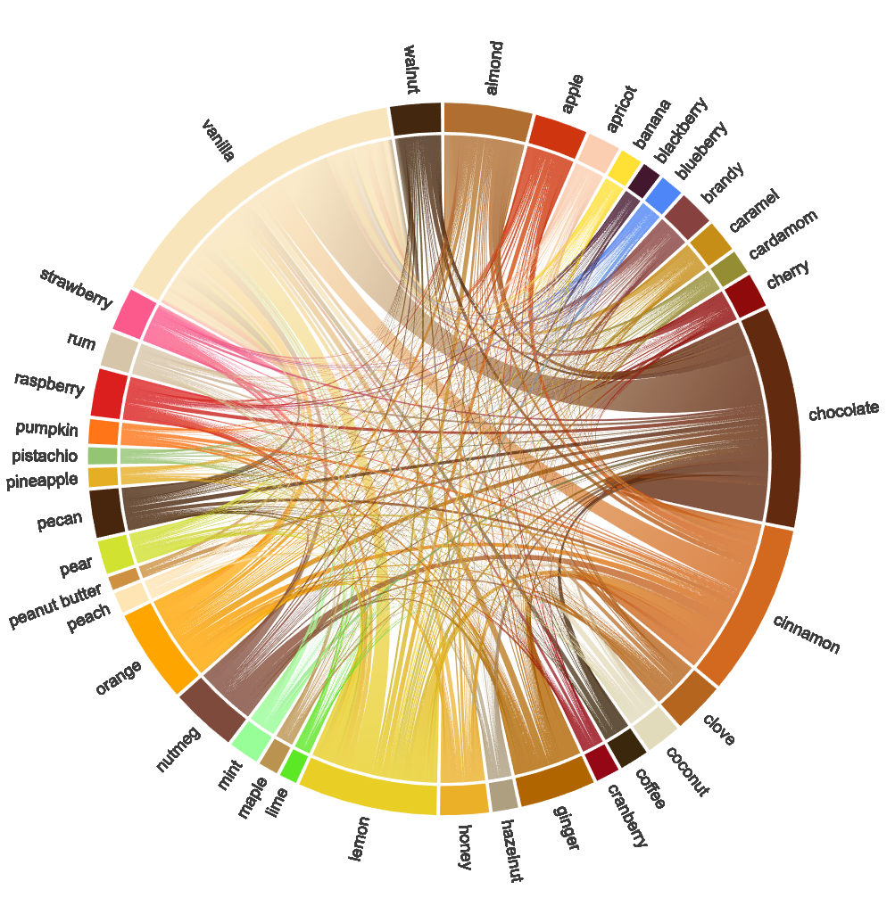

# Dessert Flavor Pairings

based on over 7,000 Epicurious dessert recipes.

See the .ipynb file for the full data wrangling, prep, and visualization in python.

data source: https://www.kaggle.com/keytarrockstar/dessert-flavor-combinations

interactive website: https://ringhilterra.github.io/dessert-flavor-pairings/

